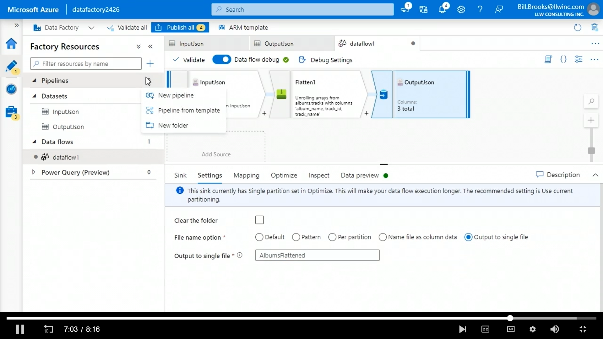
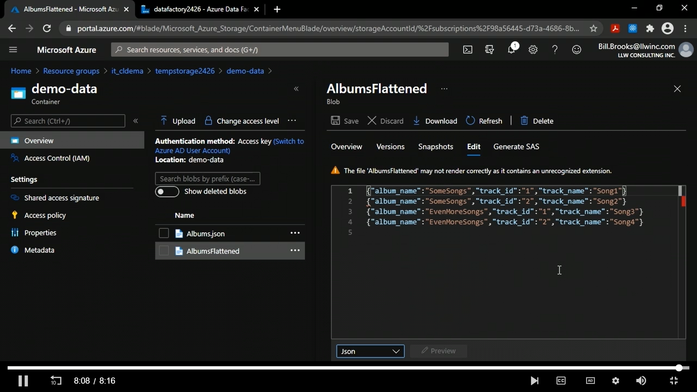

In this task, we are going to flatten the json file stored in a Container in our storage account.

In the json file, the data is an array of arrays, so we are going to flatten it to individual records.

This is the json file data:

```json
{"albums":[{"name":"SomeSongs","tracks":[{"trackid":1,"name":"Song1"},{"trackid":2,"name":"Song2"}]},{"name":"EvenMoreSongs","tracks":[{"trackid":1,"name":"Song3"},{"trackid":2,"name":"Song4"}]}]}
```

## 1. Create a linked service to blob storage

## 2. Create datasets

We create 2 datasets: 1 for input json file, 1 for output json

## 3. Create dataflow

Turn on Data flow debug option at the top

set the source to input json

Choose flatten under schema modifier for the transformation

In flatten settings:
Unroll by albums.tracks

If we look at the data preview, we can see the data is flattened.

 


We need to set the sink options to output to single file and give a file name.


 


Now, we create the pipeline by dragging this data flow and trigger it.

If we go to the container, a new file is created as shown below.



---

Done !!!

Data flow allows us to manipulate the json files

