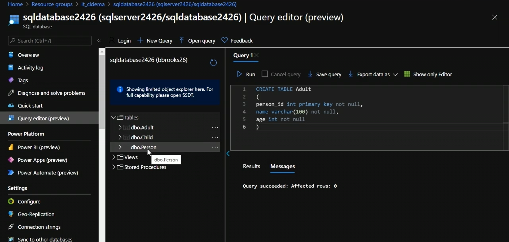
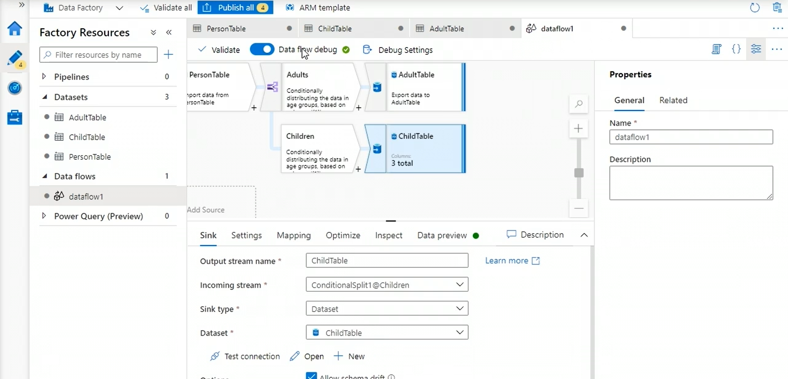

In this task, we are going to use conditional split in Azure Data Factory to split the data in a Persons table present in Azure SQL Database to split the data based on the age column.

Persons who are under age of 18 -> goes into Child table
Persons who are above age of 18 -> goes into Adult table

We have 3 tables in our SQL database with
Person table -> 10 records
Child -> empty
Adult -> empty

```sql
CREATE TABLE Person
(
person_id int primary key not null,
name varchar(100) not null,
age int not null
)

INSERT INTO Person
(person_id,[name],age)
values
(1,'Fred Smith', 25),
(2,'Louise Wilson', 12),
(3,'Samson Peters', 44),
(4,'Angus Jefferson', 10),
(5,'Penelope Cruz', 55),
(6,'Abe Lincoln', 88),
(7,'Lana Croft', 17),
(8,'Steven Peterson', 62),
(9,'Paula Brooks', 18),
(10,'Xavier Lipton', 15)

CREATE TABLE Child
(
person_id int primary key not null,
name varchar(100) not null,
age int not null
)

CREATE TABLE Adult
(
person_id int primary key not null,
name varchar(100) not null,
age int not null
)
```



---

## Data Factory steps

### 1. Create a linked service to the SQL database

### 2. Create datasets
we need to create datasets that points to those 3 tables

### 3. Create data flows



### 4. Create pipeline

Drag the data flow onto the pipeline

click publish all

Now, click Trigger now at the top ribbon to run the pipeline

### 5. Check the tables in the SQL database

If we go back to the sql database and check the tables Adult and Child, it should have data based on the conditional logic.

---

Done !!!

