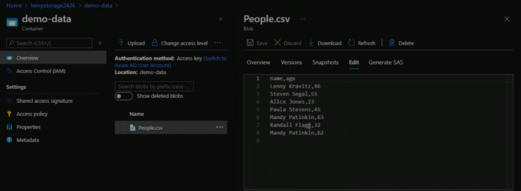
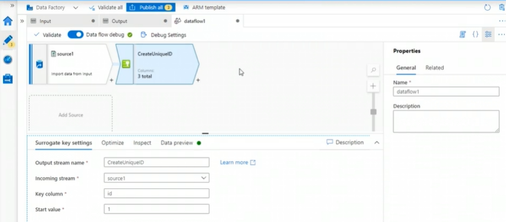
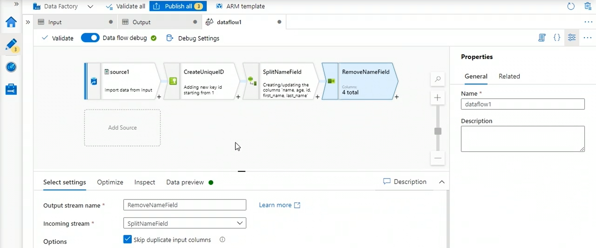
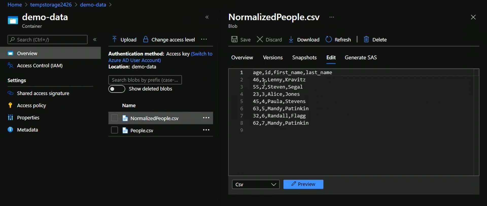

We have a container demo-data with a csv file 

We are going to split the name column into 2 columns - First name and Last name

## Open the Data Factory

### 1. Create a linked service

We create a linked service for Blob storage

### 2. Create datasets

Create 2 datasets

1 for input data (People.csv)

1 for output data (output after tranformations)

For both the datasets, we select the same container.

### 3. Create new dataflow

Set source to the csv file

Now, we select a transformation by clicking on the + icon

Surrogate Key creates a new column with unique identifier for each record. It creates incremental values so that the values are unique starting from a start value.

Next, we're going to split our name column, for this we use a transformation called derived column.

Now, we use "select" transformation to select the columns we want in the next step.

Using this, we can remove the columns we don't want in the next step

At the end, we select the sink for our output.

In settings, set output to single file and give name to the output file..

### 4. Create a pipeline

Create a pipeline by dragging the data flow created and publish all. Then, trigger now..

We now have the new file with applied transformations.

---

Done !!!

