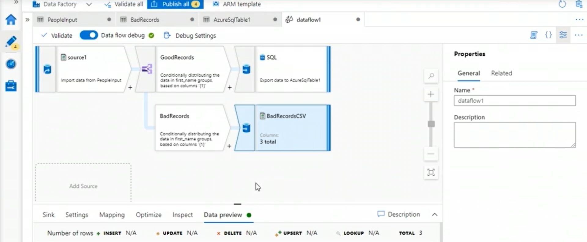

We have 2 containers in our storage account

- bad-records
- demo-data

Inside demo-data, we have a csv file "People.csv"

```csv
first_name,last_name,age
Lenny,Kravitz,46
Steven,Segal,55
Alice,Jones,23
Paula,Stevens,45
Mandy,Patinkin,63
Randall,Flagg,32
Steven,Segal,55
Paula,Stevens,45
Mandy,Patinkin,62
```

Inside out sql database, we have created a table called People.

Notice the first_name has 5 character limit. This is created to do this task of error handling.

```sql
CREATE TABLE People
(
first_name varchar(5),
last_name varchar(25),
age int
)
```

---

# Data factory steps

## 1. Create linked services

Create linked service to blob storage for our source

Create linked service to SQL database for our sink

## 2. Create datasets

1 dataset for People.csv in blob storage

1 dataset for bad records in blob storage

1 dataset for People table in SQL database

## 3. Create new dataflow
Choose source

Use conditional split to split good records (length(first_name)<=5) and bad records

Choose sink for good records -> sql database table

Choose sink for bad records -> bad-records container

- choose output as single file and give the file name



## 4. Create pipeline and run
Create a pipeline, and publish all

Click trigger now to run the pipeline

## 5. Check the SQL database and container

You should now see the table in SQL database populated as per the conditional logic

You should also see the bad-records container, a new file is created based on conditional logic. 

You should see a csv file with first_name > 5 characters.


