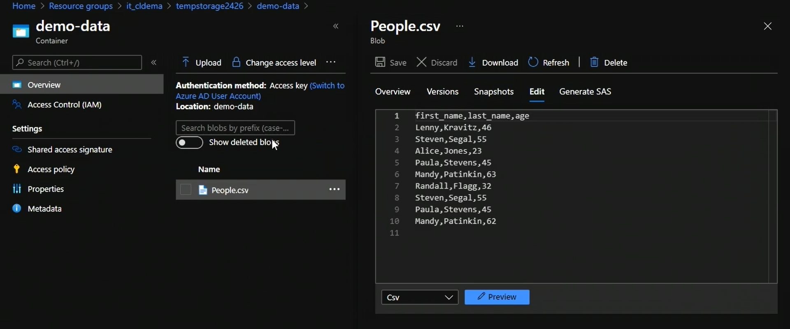
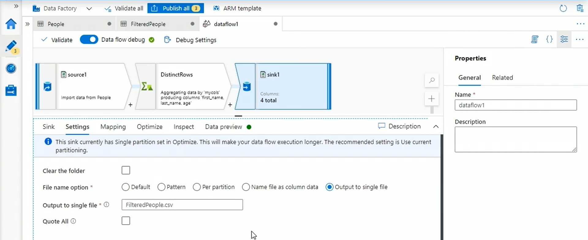
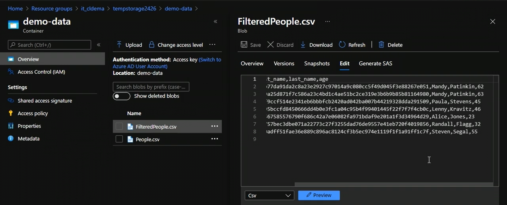

In this task, we are going to remove duplicates from a csv file present in a container.

## Open data factory

### 1. Create linked service to blob storage

### 2. Create datasets for source and sink

### 3. Create new data flow

We can modify the data flow using a script as well. Click on script icon at the top right to write script to do the transformations.

We use distinct Rows transformation to remove the duplicates.

### 4. Create new pipeline and run it

Now, if we check the container, we have a new file.

---

Done !!!

