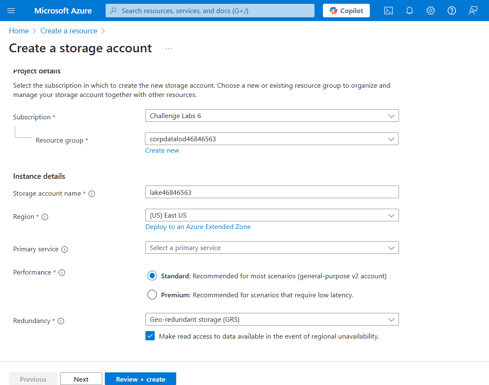
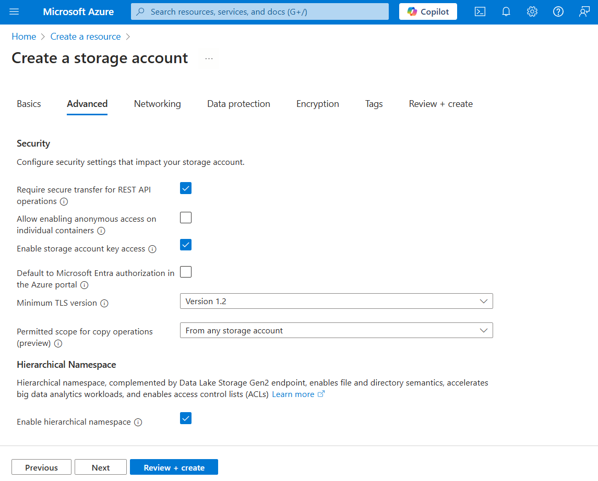
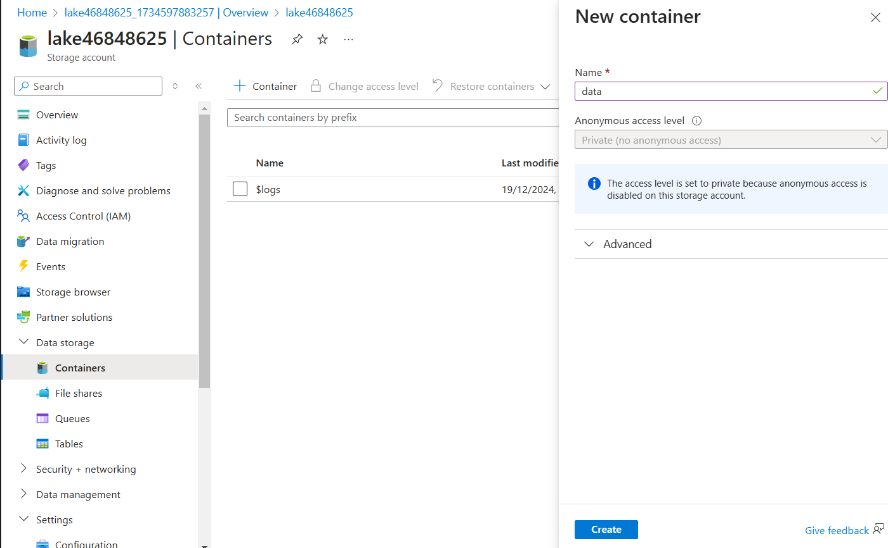
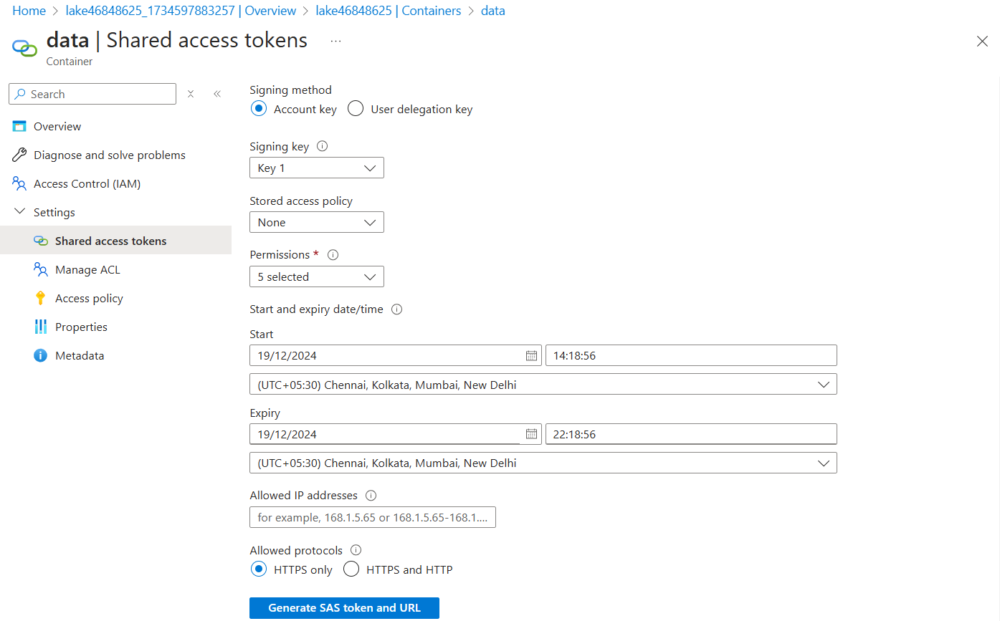
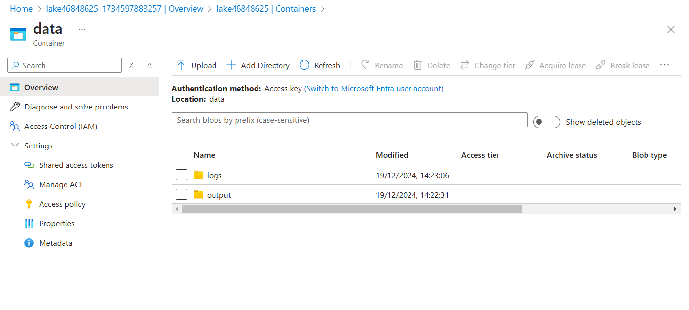
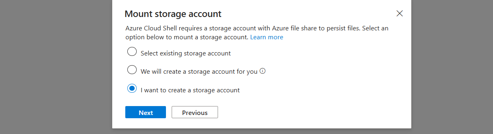
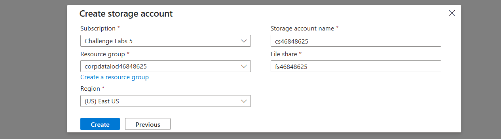

## 1. Create a storage account



Enable the hierarchical namespace to create a Data Lake



---

Quick question:

You plan to implement Azure Data Lake Storage by using a hierarchical namespace. You need to execute performance benchmarks to optimize the upload and download of large data files. Your solution must use a minimum of development effort.


What should you use?

The AzCopy utility
Azure Data Explorer
Azure Data Factory
A Synapse data pipeline

Answer: A

---

## 2. Create a container



Go to the container and update the shared access tokens



Click on Generate SAS token and URL

Create 2 directories in this container



### 3. Run performance benchmarks to optimize and ingest data for a data lake

Create an Azure Cloud Shell (PowerShell) session by using the values in the following table.

Click mount storage account





---

Run an upload performance benchmark by using the azcopy benchmark command

- You can use AzCopy to copy blobs or files to or from a storage account—including support for Data Lake Storage. 
- You can use AzCopy to optimize performance by running performance benchmarks to view performance statistics and to identify bottlenecks.

```sh
azcopy benchmark --mode='Upload' "https://lake46848625.blob.core.windows.net/data.." --file-count 300 --delete-test-data=false
```

---

Run a download performance benchmark by using the azcopy benchmark command

```sh
azcopy benchmark --mode='Download' "https://lake46848625.blob.core.windows.net/data..." --delete-test-data=false
```

---

Open the "data" container to view the new directory created by upload benchmark.

Open the new directory, and then review the contents created by the upload benchmark.

The new directory starts with "benchmark" as prefix.

