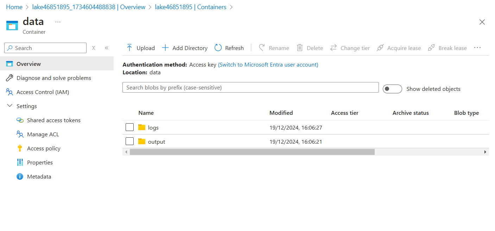
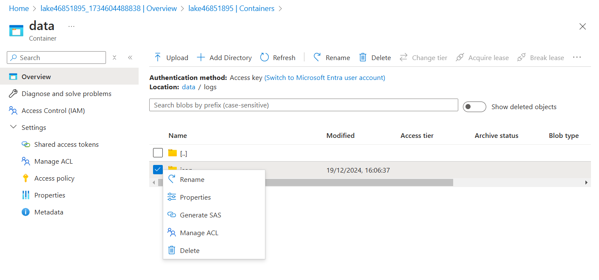
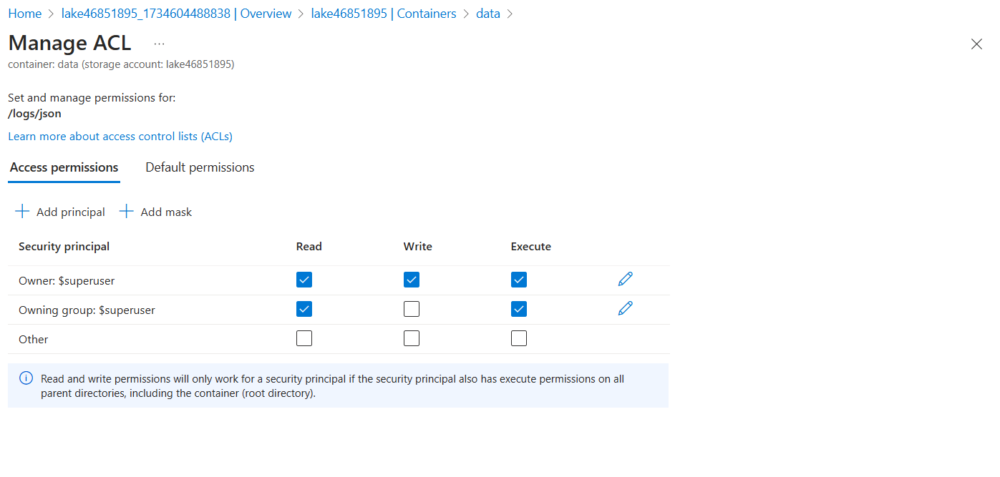
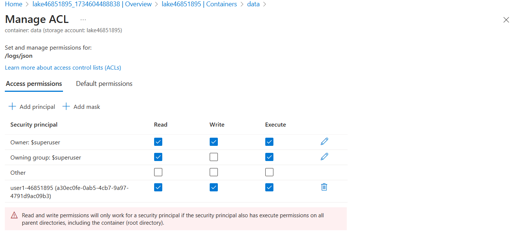
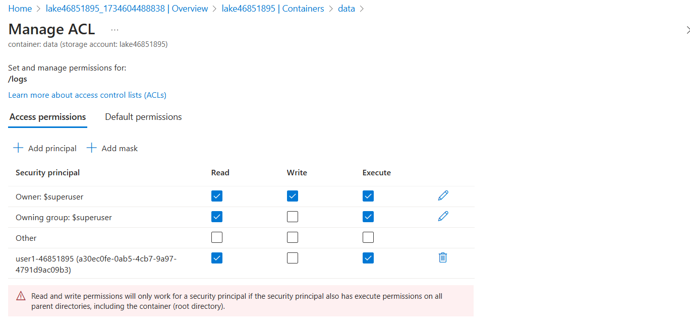
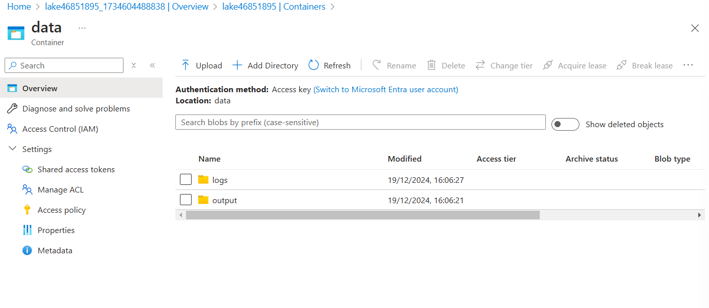
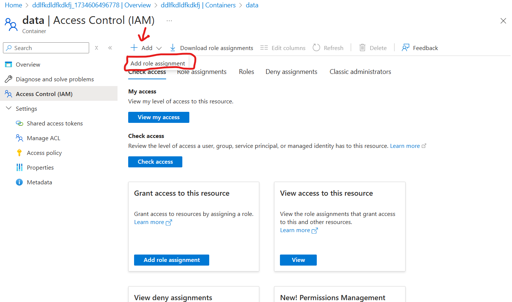
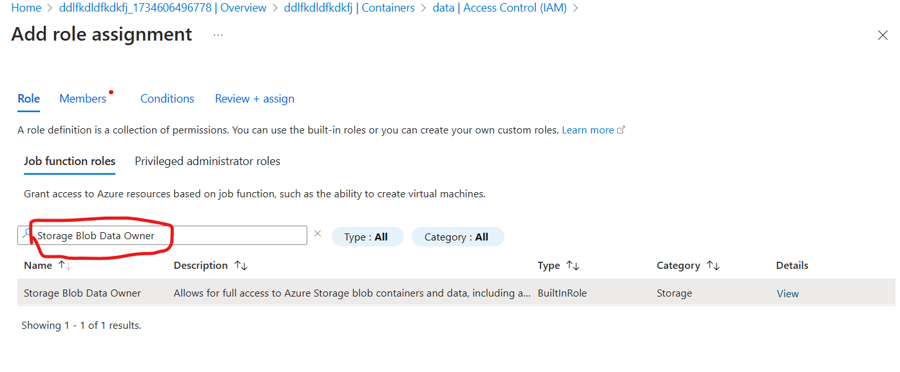
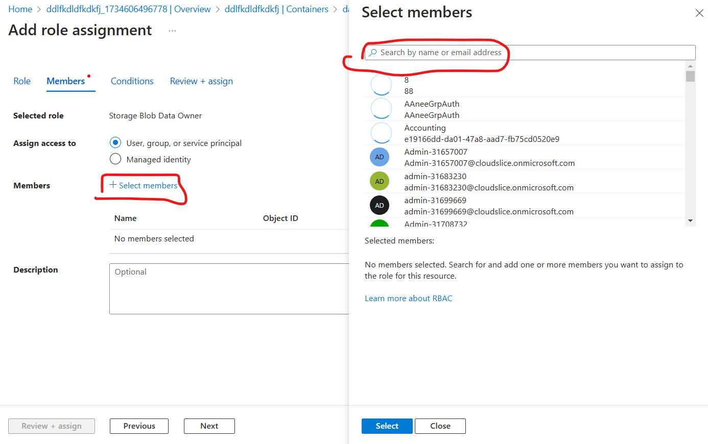

The security model in Azure Data Lake Storage supports both RBAC and ACLs. Azure role assignments are evaluated first. They take priority over any ACL assignments.

ACLs support user permissions being set at the directory level. 

RBAC supports assigning roles for access. Both ACLs and RBAC can be used together.

ACL and RBAC permissions are evaluated in the following order:

RBAC assignments are evaluated first and take priority over any ACL assignments.

ACLs are not evaluated if the operation is fully authorized based on RBAC assignments.

ACL assignments are evaluated when the operation is not fully authorized.

ACL assignments are not evaluated first and do not take priority over any RBAC assignments. 

When evaluating RBAC and ACL assignments, both RBAC and ACL are not always evaluated.

---

## 1. Create storage account by enabling hierarchical namespace

## 2. Create container and directories

Inside the data container, create 2 directories: logs and output

Inside logs, create a child directory called "json"

## 3. Enable and verify ACL and RBAC security

Right click directory and click manage acl

click add principal and search for a user to manage the access.

click save

Note:

ACL permissions do not support inheritance, so you will have to set execute permissions on all parent directories, including the container—the root directory. You will also need to set read permissions so that the user can display the directory structure of the container in the Azure portal for testing.

Now, manage the ACL for parent directory "logs"

Now, assign the ACL permissions to the container "data" by clicking on manage ACL on the left settings

Open the Azure Portal in new incognito window and sign in with the user and try uploading any file to the logs directors. we get an error that we don't have access to do this as we don't have write permissions.

Now, we are going to implement RBAC to the "data" container

for this, click on Access control (IAM) on the left of container overview page and choose "Storage Blob Data Owner" in add role option and add member "user"

Now, the user is assigned the owner role, which overrides the ACLs for the directories. 

Now, try uploading a file to the logs directory and it should work now.

---

Done !!!!

