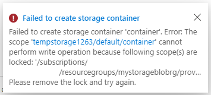
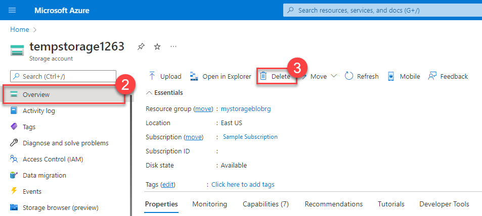

# Configure a resource lock

## Task 1: Create a resource

Create a storage account.

| Setting              | Value                                |
|----------------------|--------------------------------------|
| Resource group       | Create new                          |
| Storage account name | Enter a unique storage account name |
| Location             | Default                             |
| Performance          | Standard                            |
| Redundancy           | Locally redundant storage (LRS)     |

---

## Task 2: Apply a read-only resource lock

---

## Task 3: Add a container to the storage account

You should receive an error message: Failed to create storage container.

---

## Task 4: Modify the resource lock and create a storage container

Change the lock type to delete

Now, you should be able to create a container.

read-only lock prevented you from adding a container to your storage account. 

Once the lock type was changed (or removed), you were able to add a container.

## Task 5: Delete the storage account

You should get a notification letting you know you can't delete the resource because it has a delete lock. In order to delete the storage account, you need to remove the delete lock.

## Task 6: Remove the delete lock and delete the storage account

Remove the lock, then delete the storage account.

---

Done !!!