## Task

Automate the process of populating the Excel file "OrderTracker.xlsx" with the information from each of the documents in the folder "Cookie Order Forms"

## Steps

### 1. Click on new flow
1. Open power automate desktop
2. Click on new flow
3. Give a name to the flow and select create
4. This opens the flow designer

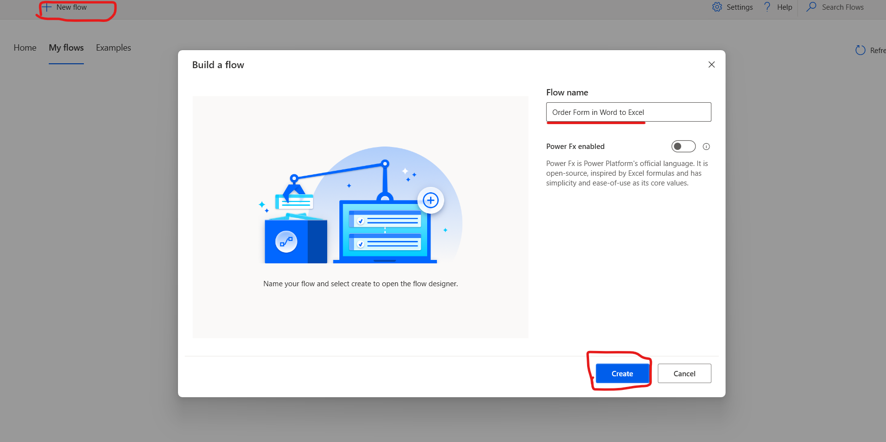

## 2. Get the files from the folder

Actions on the left: select Folder

Under folder, drag the "Get files in folder" option

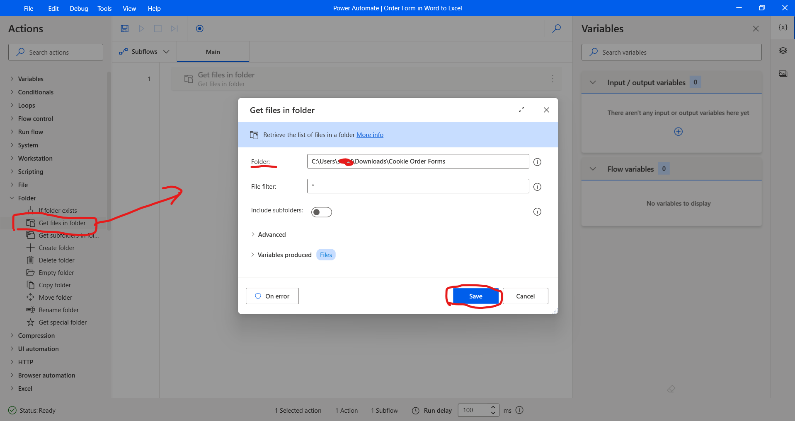

## 3. Launch Excel

Drag "launch Excel" from Excel Actions

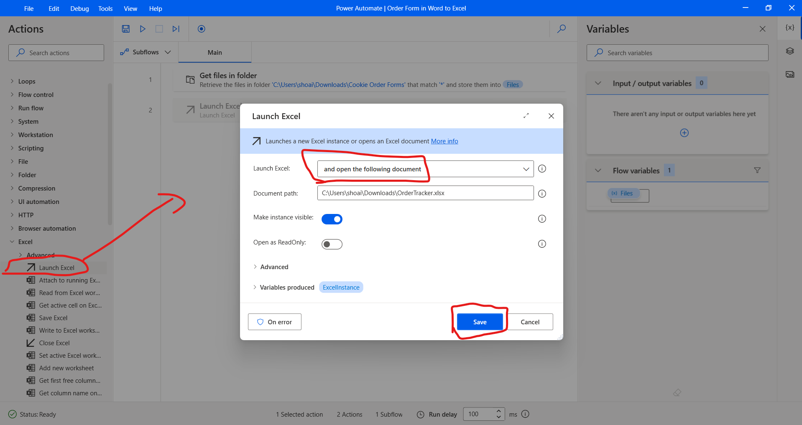

## 4. Loops

We want the details for each file in the folder. So, under Loops in actions, select "for each"

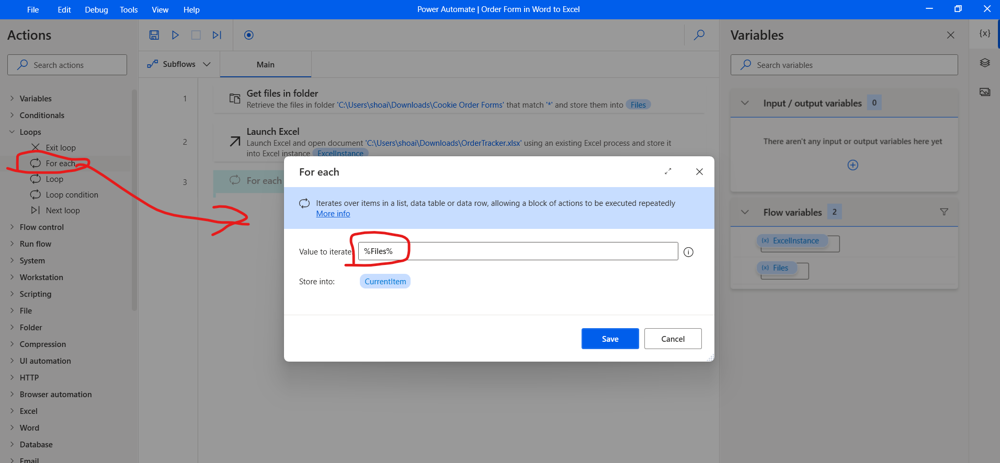

## 5. Rename file

Inside our for loop, for each file, we need to rename the file

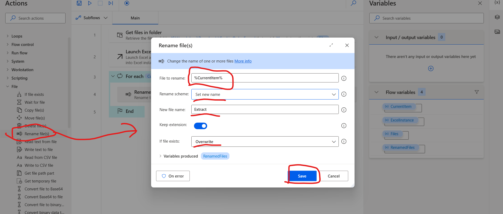

## 6. Open the file in Word to extract the details

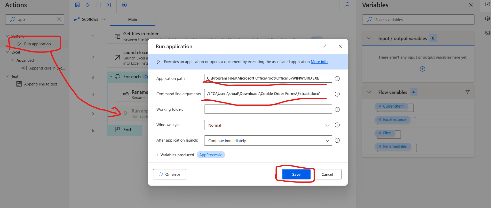

### For interacting with UI elements in Word

we create a copy of existing file and rename to Extract and open it in Word. 

Now, click on UI elements on the right

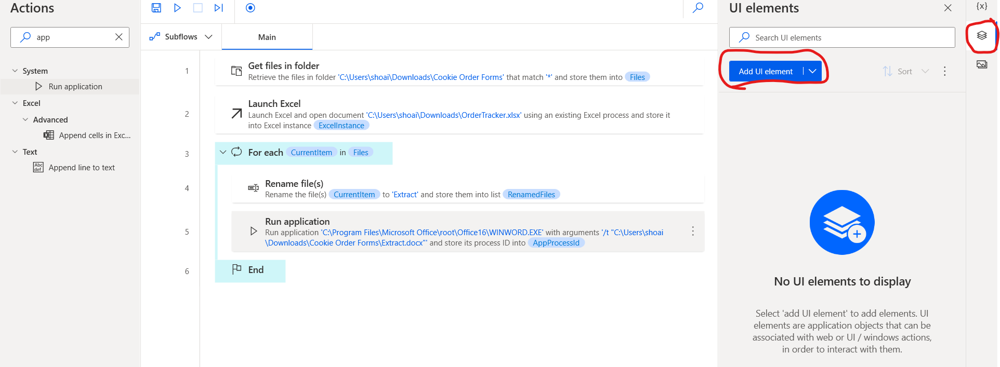

Record the UI elements in the word document, and then rename the elements with suitable names.

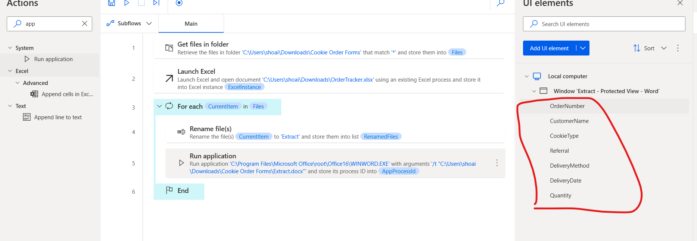

## 7. Extract data from window

We have UI elements, we need data present in those locations, so next step is extract data from window

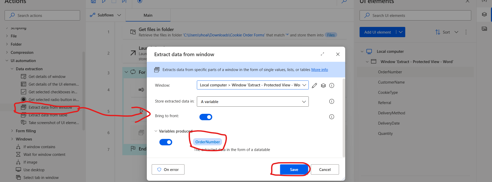

Do the same step for all the elements

## 8. Get first free row

Now, in order to add data to Excel, we need to know the first free row

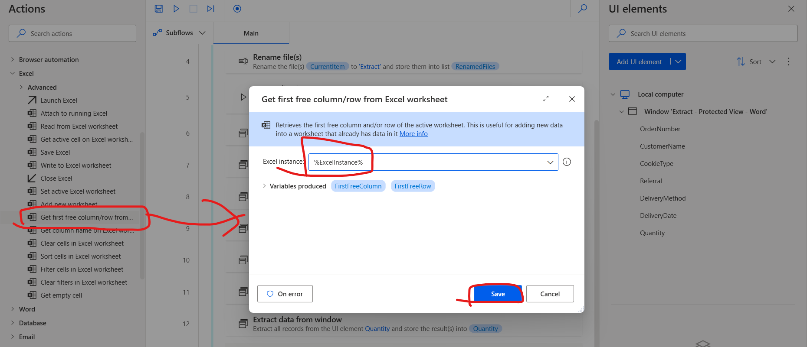

## 9. Write to excel worksheet

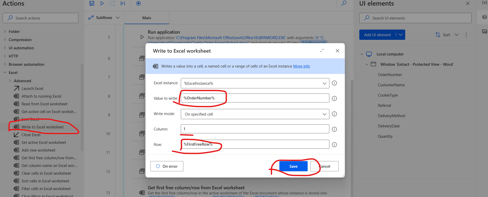

Repeat this process for all the remaining variables

## 10. Terminate the process

Once the file is done, we need to close it to open the next file

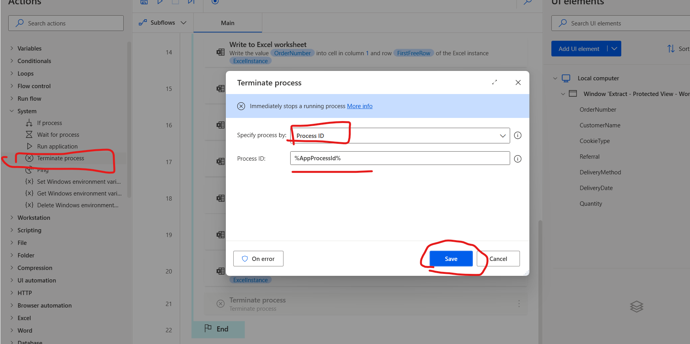

Save the flow

---
## All steps

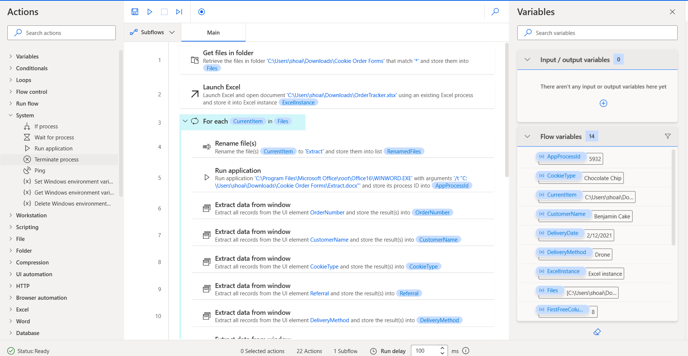

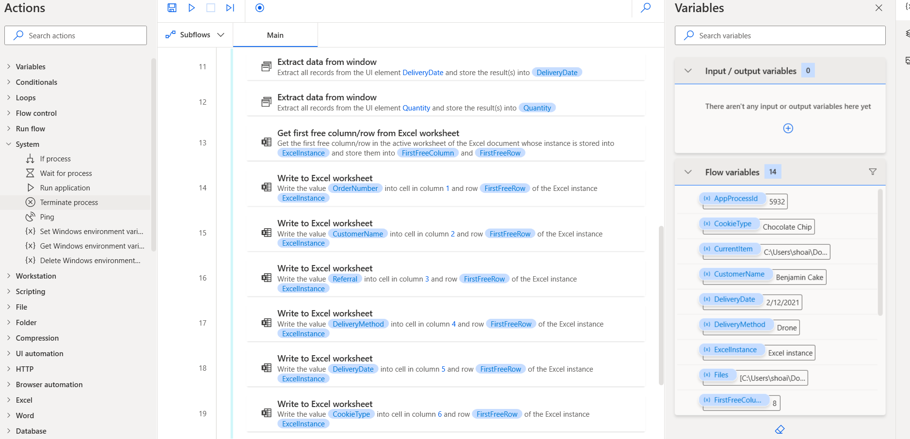

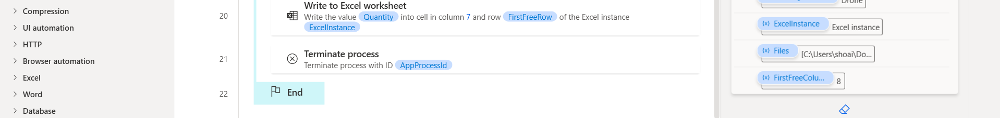

---

## Few observations:
The files from the folder are gone after running the flow, it has only one file with name as Extract.

---

## Links
Check out this video

-> [🤖 How to use Microsoft Power Automate Desktop - Full tutorial](https://www.youtube.com/watch?v=IQ_KpBC8fwo&list=PLlKpQrBME6xKE_fxQ_YzHVV7HluHpifW9&index=4)

